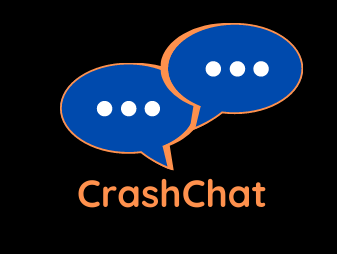
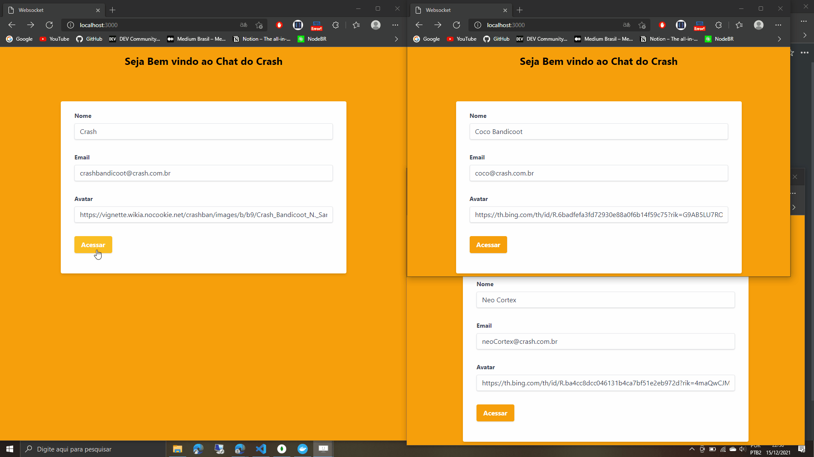

  
  # Chat WebSocket Crash

  

## Sobre

<h4 align="center">Projeto Chat WebSocket Crash</h4>

Projeto desenvolvido para adquirir conhecimentos do protocolo websocket, verificando o funcionamento de uma comunicação bidirecional, utilizando o TypeScript como forma de padronizar o projeto, projeto desenvolvido da plataforma do ignite da Rocketseat, como bônus adquirido no decorrer do curso.

## Features desenvolvidas

 

- [x] Criação de servidor de Socket io para comunicação
- [x] Criação de fluxo para comunicação de mensagens
- [x] Validação de novas mensagens recebidas
- [x] Serviço de atualização de novas mensagens recebidas ao usuário
- [x] Armazenamento de mensagens e usuários criados em banco de dados [Mongo_db]
- [ ] Criar fluxo de sign in e sign out

## Projeto

 

  

